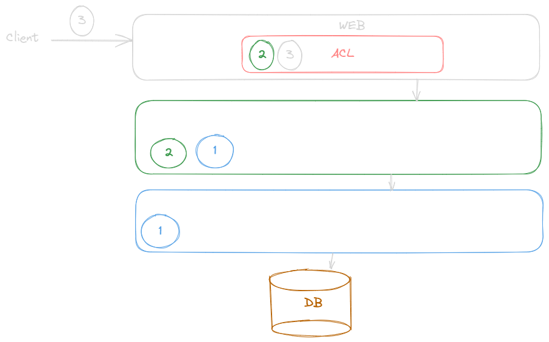

# Analyse de l'architecture

## Quelles impressions avez-vous sur l'architecture de cette application ?

### Configuration 

#### Base de données

La configuration de la base de données devrait être gérée en dehors de l'application, car c'est une problématique d'infrastructure.
Dans ce cas, l'application est agnostique par rapport à la base de données.
Dans la version actuelle, si la configuration de la base de données change, il faut produire un nouveau livrable et donc une nouvelle version.

Par ailleurs, il faut séparer la base réelle de la base de test.
Car si ce n'est pas le cas, le contenu de la base réelle peut être modifié.
Les tests risquent donc de ne plus être répétables.

#### Architecture logicielle

La version actuelle ne respecte aucun type d'architecture. 
Je proposerais une architecture en couches, d'autant plus que c'est une simple application CRUD.

##### Règles de gestion
Il ne faut pas non plus que les règles de gestion soient dans les entités JPA ou dans la couche WEB (controller).
Il faut donc créer une couche métier même si celle-ci ne fait qu'instancier les objets et appeler les méthodes de la couche DAO.
Cela permettra une meilleure compréhension du code.

##### Types de données

Un point important est de séparer les entités JPA et les DTO renvoyés par le framework. 
L'idéal est de ne pas exposer la structure de la base de données à l'extérieur de l'application en renvoyant les entités JPA dans les controllers.

De même que les interfaces repository de Spring Data et de manière générales les DAO dans une architecture en couches,
ne doivent renvoyer qu'une structure de données brutes.
Autrement dit, il ne faudrait pas utiliser des types de Spring Data dans la couche web.

#### Tests

Plusieurs tests sont inutiles, car ils testent des méthodes de la couche DAO qui ne font que des appels à la base de données;
ou ne font que tester une instanciation ou même une sérialisation avec une classe d'un framework de sérialisation.
Cela équivaut à tester la classe du Framework et non la classe de l'application.

#### Nommage

Les noms de package ne doivent pas comporter de noms de package de framework.
Un développeur ne connaissant pas l'application ne sait pas s'il se trouve dans une classe de l'application ou du framework.

#### App Cliente

Dans l'idéal, il faudrait séparer l'application cliente de l'application serveur, en utilisant une API REST et un framework SPA côté client.
Cela permettrait de séparer les responsabilités et de pouvoir changer l'application cliente sans avoir à changer l'application serveur et inversement.

#### Autres remarques 

##### Méthodes transactionnelles

Le fait d'annoter des méthodes d'interfaces avec l'annotation @Transactional est une mauvaise pratique.
Cela n'a aucun effet et la méthode n'est pas transactionnelle.
Il faut donc mettre cette annotation sur les classes concrétes 
et au niveau de l'ACL (entre la couche web et la couche métier) 
ou directement sur le point d'entrée dans la couche web lorsque cela est possible.

##### DTO

Les getters ne devraient avoir aucune logique (même pas d'instanciation).

##### Cacheable

Pour l'annotation @Cacheable, la situation est similaire à l'annotation @Transactional.
De plus, il faut séparer la gestion du cache des repository Spring Data.  

## Allez dans la classe VetController Comment pouvez-vous changer l'API pour que la vue (Html) soit séparée du modèle ?

## Créez une nouvelle branche et implémentez vos modifications dans la classe vetController
